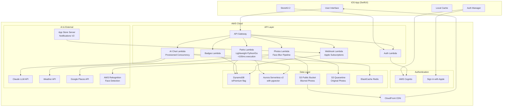
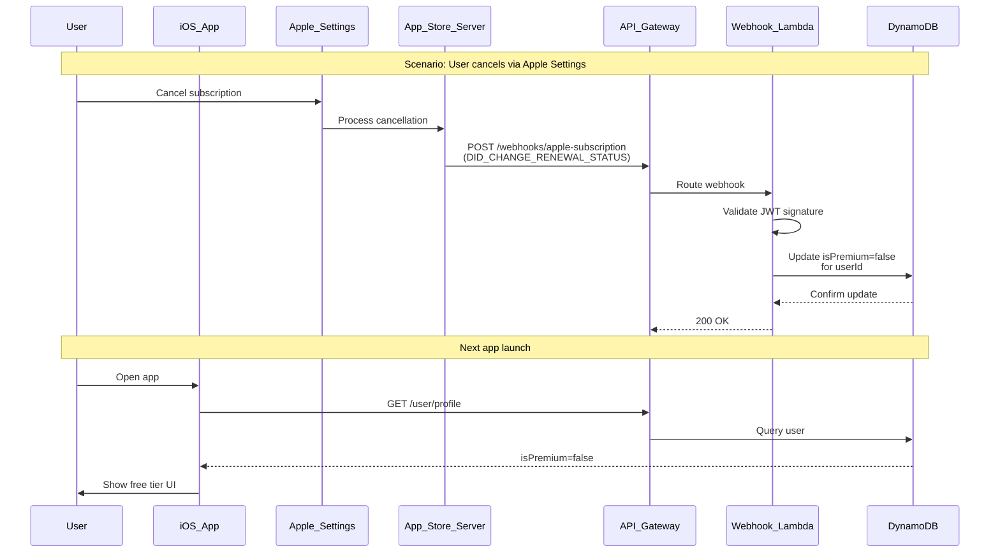
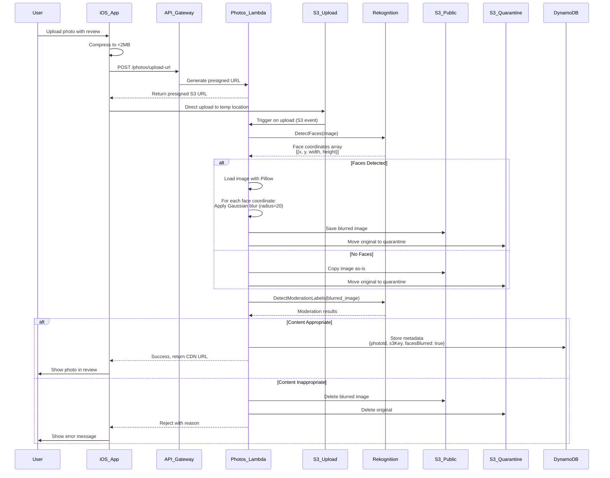
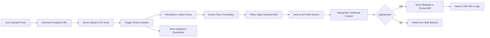

# Design Document: ParkScout Premium & AWS Migration

## Overview

This design transforms ParkScout from a monolithic, cost-intensive application into a scalable, secure, and monetizable platform using AWS serverless architecture and a freemium business model. The system will migrate from a single FastAPI server with ChromaDB to a distributed serverless architecture using AWS Lambda, DynamoDB, Aurora Serverless v2 with pgvector (or Amazon Bedrock Knowledge Bases), and Cognito.

The core architectural shift moves the AI chat feature from the main page to a premium-only feature with a "3 Free Scouts" trial, reducing LLM API costs by an estimated 60% while introducing revenue through subscriptions. The Merit Badge system gamifies data collection, turning amenity verification into engaging "Scout Intel" gathering that improves RAG quality.

Key design principles:
- **Serverless-first**: Use Lambda functions to scale to zero during low traffic, with Provisioned Concurrency for AI Chat Lambda to prevent cold start UX issues
- **Cost-conscious**: Cache aggressively, rate limit appropriately, tier access strategically, use truly serverless vector database (Aurora Serverless v2 with pgvector scales to zero unlike OpenSearch)
- **Security-focused**: Native iOS auth, PII protection, secure token management, automated face blurring pipeline
- **Engagement-driven**: Merit badges, Scout ranks, challenges, and "3 Free Scouts" trial create sticky user experiences
- **Data quality**: Higher-ranked scouts' contributions weighted more heavily in recommendations
- **Mom-centric safety**: Automated face blurring in all uploaded photos protects children's privacy

## Architecture

### Architecture Decision Rationale

**Why Aurora Serverless v2 with pgvector over OpenSearch?**

For an MVP/Builder competition project, cost-effectiveness and true serverless scaling are critical:

| Factor | OpenSearch | Aurora Serverless v2 + pgvector |
|--------|-----------|--------------------------------|
| **Minimum Cost** | ~$100-200/month (minimum OCU) | ~$10-20/month (scales to $0) |
| **Scales to Zero** | ❌ No (minimum capacity) | ✅ Yes (pauses after 5 min) |
| **Cold Start** | N/A (always on) | <1 second (transparent) |
| **Vector Search** | k-NN with HNSW | pgvector with HNSW |
| **Query Performance** | Excellent | Good (sufficient for MVP) |
| **Developer Experience** | New query syntax | Familiar PostgreSQL |
| **Managed Service** | ✅ Yes | ✅ Yes |

**Alternative Considered**: Amazon Bedrock Knowledge Bases provides fully managed RAG, but less control over ranking logic and higher cost per query.

**Why Provisioned Concurrency for AI Chat Lambda?**

The AI Chat Lambda is the most latency-sensitive component:
- Claude API: 2-5 seconds
- Lambda cold start: 1-3 seconds
- **Total: 3-8 seconds = Broken UX**

Provisioned Concurrency (~$22/month for 2 instances) eliminates cold starts, keeping total latency at 2-5 seconds (acceptable).

**Why Go for Parks Lambda?**

Parks Lambda handles high-frequency, low-latency requests:
- Go cold start: 100-300ms vs Python: 500-1000ms
- Go warm execution: <50ms vs Python: <100ms
- Lower memory footprint = lower cost
- Native binary = smaller deployment package

### High-Level System Architecture



### Component Responsibilities

**iOS App Layer**:
- SwiftUI-based UI with offline-first design
- Local caching of park data, user profile, and badges
- StoreKit 2 integration for subscription management
- Biometric authentication using iOS Keychain
- Photo capture, compression, and upload

**API Gateway Layer**:
- Request routing and validation
- Rate limiting (100 req/min free with 3 AI queries, 500 req/min premium)
- API key validation
- Request/response transformation
- CORS handling
- Webhook endpoint for App Store Server Notifications V2

**Lambda Functions**:
- **Auth Lambda**: User registration, login, token refresh, subscription validation
- **Parks Lambda**: Park search, details, recommendations, amenity verification (optimized for <100ms execution using lightweight Python or Go)
- **AI Chat Lambda**: LLM interactions, query caching, weather-aware recommendations (uses Provisioned Concurrency to stay warm and prevent cold start + Claude API latency issues)
- **Photos Lambda**: Upload handling, Rekognition face detection, Gaussian blur processing, Google Places integration
- **Badges Lambda**: Badge awarding, rank progression, challenge tracking
- **Webhook Lambda**: Handles App Store Server Notifications V2 for subscription lifecycle events (cancellations, renewals, refunds)

**Data Layer**:
- **DynamoDB**: User profiles (including isPremium flag), reviews, badges, amenity verifications, challenges, free trial usage tracking
- **Aurora Serverless v2 with pgvector**: Vector embeddings for semantic park search (scales to zero, more cost-effective than OpenSearch for MVP)
- **S3 Public Bucket**: Blurred, safe-for-display user photos
- **S3 Quarantine Bucket**: Original photos (archived or deleted after processing)
- **ElastiCache Redis**: LLM query cache, session data, rate limit counters

**External Services**:
- **Claude LLM**: AI chat responses with RAG context
- **Weather API**: Real-time weather data for recommendations
- **Google Places API**: Official park photos
- **AWS Rekognition**: Face detection coordinates for blurring, content moderation
- **App Store Server**: Subscription status notifications via webhooks

## Components and Interfaces

### 1. Authentication System

**Components**:
- `CognitoAuthProvider`: Manages AWS Cognito user pool interactions
- `AppleSignInHandler`: Handles Sign in with Apple flow
- `BiometricAuthManager`: iOS biometric authentication wrapper
- `TokenManager`: Secure token storage and refresh logic

**Interfaces**:

```swift
// iOS Token Manager
protocol TokenManager {
    func storeTokens(accessToken: String, refreshToken: String) async throws
    func getAccessToken() async throws -> String
    func refreshAccessToken() async throws -> String
    func clearTokens() async throws
}

// Auth Lambda API
POST /auth/register
Request: { email, password, appleToken? }
Response: { userId, accessToken, refreshToken, expiresIn }

POST /auth/login
Request: { email, password, appleToken? }
Response: { userId, accessToken, refreshToken, expiresIn }

POST /auth/refresh
Request: { refreshToken }
Response: { accessToken, expiresIn }

POST /auth/validate-subscription
Request: { userId, receiptData }
Response: { isPremium, expiresAt, productId }
```

### 1a. StoreKit 2 Subscription Sync

**Components**:
- `AppStoreWebhookHandler`: Processes App Store Server Notifications V2
- `SubscriptionStatusManager`: Updates DynamoDB isPremium flag based on Apple events
- `WebhookSignatureValidator`: Verifies Apple's JWT signature on webhook payloads

**The Source of Truth Problem**:

When users cancel subscriptions via Apple Settings (not in-app), the app has no way to know until the next app launch or receipt validation. This creates a window where users retain premium access after cancellation. App Store Server Notifications V2 solves this by pushing real-time events to our backend.

**Subscription Lifecycle Flow**:



**Webhook Endpoint Specification**:

```typescript
// Webhook Lambda API
POST /webhooks/apple-subscription
Headers: {
  'x-apple-notification-signature': string // JWT signature
}
Request: {
  signedPayload: string // Apple's signed JWT containing notification data
}
Response: { success: boolean }

// Decoded Notification Types
enum NotificationType {
  DID_CHANGE_RENEWAL_STATUS = 'DID_CHANGE_RENEWAL_STATUS',
  DID_RENEW = 'DID_RENEW',
  EXPIRED = 'EXPIRED',
  GRACE_PERIOD_EXPIRED = 'GRACE_PERIOD_EXPIRED',
  REFUND = 'REFUND',
  REVOKE = 'REVOKE'
}

interface AppleNotificationPayload {
  notificationType: NotificationType
  subtype?: string
  data: {
    appAppleId: number
    bundleId: string
    environment: 'Sandbox' | 'Production'
    signedTransactionInfo: string // JWT with transaction details
    signedRenewalInfo: string // JWT with renewal details
  }
}

// Webhook Handler Interface
interface AppStoreWebhookHandler {
  validateSignature(payload: string, signature: string): Promise<boolean>
  decodeNotification(signedPayload: string): Promise<AppleNotificationPayload>
  processNotification(notification: AppleNotificationPayload): Promise<void>
  updateUserPremiumStatus(userId: string, isPremium: boolean, expiresAt?: number): Promise<void>
}
```

**Handled Events**:
- **DID_CHANGE_RENEWAL_STATUS**: User cancels auto-renewal → Set isPremium=false at expiration
- **DID_RENEW**: Subscription renewed → Extend isPremium expiration date
- **EXPIRED**: Subscription expired → Set isPremium=false immediately
- **REFUND**: User refunded → Set isPremium=false, log for fraud detection
- **REVOKE**: Apple revoked access → Set isPremium=false immediately

**Interfaces**:

```swift
// iOS StoreKit 2 Manager
protocol SubscriptionManager {
    func purchaseSubscription(productId: String) async throws -> Transaction
    func restorePurchases() async throws -> [Transaction]
    func checkSubscriptionStatus() async throws -> SubscriptionStatus
    func syncWithBackend(transaction: Transaction) async throws
}

struct SubscriptionStatus {
    let isPremium: Bool
    let expiresAt: Date?
    let productId: String?
    let autoRenewEnabled: Bool
}
```

### 2. Tiered Access System with Free Trial

**Components**:
- `TierValidator`: Middleware checking user tier for protected endpoints
- `RateLimiter`: Redis-backed rate limiting per user tier
- `PaywallPresenter`: iOS UI component for subscription prompts
- `FreeTrialTracker`: Tracks "3 Free Scouts" usage for free users

**The "Aha! Moment" Problem**:

Free users need to experience AI chat quality before subscribing. The "3 Free Scouts" trial gives free users 3 AI chat queries to try the premium feature, creating an "Aha! Moment" that drives conversion.

**Tier Configuration**:

```typescript
interface TierConfig {
  free: {
    aiChatAccess: true, // NEW: 3 free queries
    freeTrialQueries: 3, // NEW: "3 Free Scouts"
    reviewTextAccess: false,
    photoUploadsPerReview: 5,
    rateLimit: 100, // requests per minute
    recommendationsCount: 5
  },
  premium: {
    aiChatAccess: true,
    freeTrialQueries: 0, // Not applicable
    reviewTextAccess: true,
    photoUploadsPerReview: 5,
    rateLimit: 500,
    recommendationsCount: 10,
    aiQueriesPerHour: 50
  }
}
```

**Free Trial Tracking**:

```typescript
interface FreeTrialTracker {
  getRemainingQueries(userId: string): Promise<number>
  consumeQuery(userId: string): Promise<{ remaining: number, exhausted: boolean }>
  resetTrial(userId: string): Promise<void> // Admin function only
}

// DynamoDB Schema Addition
{
  PK: "USER#<userId>",
  SK: "PROFILE",
  // ... existing fields
  freeTrialQueriesUsed: number, // 0-3
  freeTrialExhaustedAt: timestamp // When user hit 3 queries
}
```

**Interfaces**:

```typescript
// Tier Validation Middleware
interface TierValidator {
  validateAccess(userId: string, feature: string): Promise<boolean>
  getUserTier(userId: string): Promise<'free' | 'premium'>
}

// Rate Limiter
interface RateLimiter {
  checkLimit(userId: string, tier: string): Promise<{ allowed: boolean, remaining: number, resetAt: number }>
  incrementCounter(userId: string): Promise<void>
}
```

### 3. Merit Badge System

**Components**:
- `BadgeEngine`: Core logic for badge awarding and verification
- `AmenityVerifier`: Validates and tracks amenity verifications
- `BadgeAnimationController`: iOS animation coordinator

**Badge Definitions**:

```typescript
interface AmenityBadge {
  id: string
  name: string // "The Golden Throne", "The Fortress", etc.
  amenityType: 'bathroom' | 'fenced' | 'shade' | 'coffee' | 'stroller'
  description: string
  icon: string
  masterLevel: boolean // true if 3+ users verified
}

interface BadgeAward {
  userId: string
  badgeId: string
  parkId: string
  awardedAt: timestamp
  isFirstVerifier: boolean
}
```

**Interfaces**:

```typescript
// Badge Engine
interface BadgeEngine {
  verifyAmenity(userId: string, parkId: string, amenityType: string, verified: boolean): Promise<BadgeAward[]>
  checkMasterBadge(parkId: string, amenityType: string): Promise<boolean>
  getUserBadges(userId: string): Promise<BadgeAward[]>
  getParkBadges(parkId: string): Promise<AmenityBadge[]>
}

// API Endpoints
POST /badges/verify
Request: { userId, parkId, amenityType, verified }
Response: { badges: BadgeAward[], rankProgress: number }

GET /badges/user/:userId
Response: { badges: BadgeAward[], totalCount: number }

GET /badges/park/:parkId
Response: { badges: AmenityBadge[], verificationCount: { [amenityType]: number } }
```

### 4. Scout Rank Progression

**Components**:
- `RankCalculator`: Computes rank based on contributions
- `ContributionTracker`: Tracks all user activities
- `RankWeightingEngine`: Applies rank-based weights to recommendations

**Rank Definitions**:

```typescript
interface ScoutRank {
  rank: 'tenderfoot' | 'trailblazer' | 'pathfinder' | 'park_legend'
  minContributions: number
  weight: number // for recommendation algorithm
  displayName: string
  icon: string
}

const RANKS: ScoutRank[] = [
  { rank: 'tenderfoot', minContributions: 0, weight: 1.0, displayName: 'Tenderfoot', icon: 'tent' },
  { rank: 'trailblazer', minContributions: 5, weight: 1.5, displayName: 'Trailblazer', icon: 'compass' },
  { rank: 'pathfinder', minContributions: 15, weight: 2.0, displayName: 'Pathfinder', icon: 'map' },
  { rank: 'park_legend', minContributions: 50, weight: 3.0, displayName: 'Park Legend', icon: 'star' }
]
```

**Interfaces**:

```typescript
interface RankCalculator {
  calculateRank(contributions: ContributionSummary): ScoutRank
  checkRankUp(userId: string, newContribution: Contribution): Promise<{ rankedUp: boolean, newRank?: ScoutRank }>
}

interface ContributionSummary {
  reviews: number
  amenityVerifications: number
  photos: number
  parkVisits: number
  socialShares: number
  total: number
}

// API Endpoints
GET /rank/:userId
Response: { rank: ScoutRank, contributions: ContributionSummary, nextRank: ScoutRank, progress: number }

POST /contributions/track
Request: { userId, type: 'review' | 'amenity' | 'photo' | 'visit' | 'share', metadata: object }
Response: { success: boolean, rankUp?: ScoutRank }
```

### 5. AI Chat with Caching and Provisioned Concurrency

**Components**:
- `LLMOrchestrator`: Manages Claude API interactions
- `QueryCache`: Redis-based cache for common queries
- `RAGRetriever`: Fetches relevant park data from Aurora pgvector
- `WeatherContextProvider`: Adds weather data to LLM context

**Cold Start Risk Mitigation**:

The AI Chat Lambda is the most latency-sensitive component:
- Claude API latency: 2-5 seconds for responses
- Lambda cold start: 1-3 seconds for Python runtime
- **Combined latency = 3-8 seconds = Broken UX**

**Solution**: Configure Provisioned Concurrency for AI Chat Lambda to keep 1-2 instances "warm" at all times. This eliminates cold starts for the critical path.

```typescript
// Lambda Configuration (CDK/Terraform)
const aiChatLambda = new lambda.Function(this, 'AIChatLambda', {
  runtime: lambda.Runtime.PYTHON_3_11,
  handler: 'ai_chat.handler',
  timeout: Duration.seconds(30),
  memorySize: 1024,
  // CRITICAL: Provisioned Concurrency to prevent cold starts
  reservedConcurrentExecutions: 5, // Max concurrent
});

// Add Provisioned Concurrency
const version = aiChatLambda.currentVersion;
const alias = new lambda.Alias(this, 'AIChatAlias', {
  aliasName: 'prod',
  version: version,
  provisionedConcurrentExecutions: 2, // Keep 2 warm instances
});
```

**Cost Impact**: Provisioned Concurrency costs ~$0.015/hour per instance = ~$22/month for 2 instances. This is acceptable for the UX improvement.

**Caching Strategy**:

```typescript
interface QueryCache {
  getCachedResponse(normalizedQuery: string): Promise<string | null>
  cacheResponse(normalizedQuery: string, response: string, userCount: number): Promise<void>
  incrementUserCount(normalizedQuery: string): Promise<number>
  shouldCache(userCount: number): boolean // true if userCount >= 3
}

interface QueryNormalizer {
  normalize(query: string): string // lowercase, remove punctuation, stem words
}
```

**LLM Context Structure**:

```typescript
interface LLMContext {
  userQuery: string
  userRank: ScoutRank
  relevantParks: Park[] // from RAG
  weather: WeatherData
  userPreferences: UserPreferences
  conversationHistory: Message[]
}

interface WeatherData {
  temperature: number
  condition: 'sunny' | 'cloudy' | 'rainy' | 'snowy'
  humidity: number
  forecast: DayForecast[]
}
```

**Interfaces**:

```typescript
// AI Chat Lambda
POST /chat/query
Request: { userId, query, conversationId? }
Response: { response: string, cached: boolean, sources: Park[], remainingQueries: number }

// RAG Retriever
interface RAGRetriever {
  retrieveRelevantParks(query: string, limit: number): Promise<Park[]>
  retrieveWithWeather(query: string, weather: WeatherData, limit: number): Promise<Park[]>
}
```

### Parks Lambda Optimization

**Performance Requirements**:

The Parks Lambda handles high-frequency requests (search, details, recommendations) and must be fast:
- Target: <100ms execution time
- No Provisioned Concurrency needed if execution is fast enough
- Cold starts acceptable if <200ms total

**Implementation Strategy**:

Option 1: **Lightweight Python**
- Use minimal dependencies (boto3, psycopg2-binary only)
- Avoid heavy frameworks like Flask/FastAPI in Lambda
- Use Lambda Powertools for structured logging
- Keep deployment package <10MB

Option 2: **Go Runtime** (Recommended for best performance)
- Go compiles to native binary (faster cold starts)
- Typical cold start: 100-300ms vs Python's 500-1000ms
- Lower memory footprint
- Better for high-frequency, low-latency endpoints

```go
// Example Go Lambda for Parks Search
package main

import (
    "context"
    "encoding/json"
    "github.com/aws/aws-lambda-go/lambda"
    "github.com/jackc/pgx/v5/pgxpool"
)

var pool *pgxpool.Pool

func init() {
    // Connection pool initialized once per container
    var err error
    pool, err = pgxpool.New(context.Background(), os.Getenv("DATABASE_URL"))
    if err != nil {
        panic(err)
    }
}

func handleSearch(ctx context.Context, event SearchEvent) (SearchResponse, error) {
    // Fast query execution
    rows, err := pool.Query(ctx, "SELECT * FROM parks WHERE name ILIKE $1 LIMIT 10", "%"+event.Query+"%")
    // ... process results
    return response, nil
}

func main() {
    lambda.Start(handleSearch)
}
```

**Benchmark Targets**:
- Go Lambda cold start: <200ms
- Go Lambda warm execution: <50ms
- Python Lambda cold start: <500ms
- Python Lambda warm execution: <100ms

### 6. Photo Management with Safety Pipeline (Critical for Mom-Centric App)

**Components**:
- `PhotoUploader`: Handles presigned URL generation and upload
- `RekognitionProcessor`: Face detection with coordinate extraction
- `FaceBlurProcessor`: Applies Gaussian blur using Pillow (Python) to face coordinates
- `PhotoSafetyPipeline`: Orchestrates the complete safety workflow
- `GooglePlacesPhotoFetcher`: Retrieves and caches official photos
- `PhotoGalleryRenderer`: iOS UI component for photo display

**The Business Risk**:

ParkScout is a "Mom-Centric" app where parents share photos of their children at parks. Without automated face blurring, we risk exposing children's faces publicly, creating privacy concerns and potential legal liability. This is the "Secret Sauce" differentiator that makes ParkScout safe for families.

**Photo Safety Pipeline (Detailed Sequence)**:



**Face Blurring Implementation Details**:

```python
# Photos Lambda - Face Blur Processing
from PIL import Image, ImageFilter
import boto3

def blur_faces(image_bytes: bytes, face_coordinates: list) -> bytes:
    """
    Apply Gaussian blur to detected face regions.
    
    Args:
        image_bytes: Original image as bytes
        face_coordinates: List of face bounding boxes from Rekognition
            Format: [{'BoundingBox': {'Left': 0.1, 'Top': 0.2, 'Width': 0.15, 'Height': 0.2}}]
    
    Returns:
        Blurred image as bytes
    """
    img = Image.open(io.BytesIO(image_bytes))
    width, height = img.size
    
    for face in face_coordinates:
        box = face['BoundingBox']
        
        # Convert Rekognition percentages to pixel coordinates
        left = int(box['Left'] * width)
        top = int(box['Top'] * height)
        face_width = int(box['Width'] * width)
        face_height = int(box['Height'] * height)
        
        # Add padding around face (20% on each side)
        padding = int(max(face_width, face_height) * 0.2)
        left = max(0, left - padding)
        top = max(0, top - padding)
        right = min(width, left + face_width + 2 * padding)
        bottom = min(height, top + face_height + 2 * padding)
        
        # Extract face region
        face_region = img.crop((left, top, right, bottom))
        
        # Apply Gaussian blur (radius=20 for strong blur)
        blurred_face = face_region.filter(ImageFilter.GaussianBlur(radius=20))
        
        # Paste blurred region back
        img.paste(blurred_face, (left, top))
    
    # Save to bytes
    output = io.BytesIO()
    img.save(output, format='JPEG', quality=85)
    return output.getvalue()
```

**Processing Pipeline**:



**Interfaces**:

```typescript
// Photo Upload
POST /photos/upload-url
Request: { userId, parkId, reviewId, fileType: string }
Response: { uploadUrl: string, photoId: string, expiresIn: number }

POST /photos/process
Request: { photoId, s3Key }
Response: { success: boolean, blurredUrl?: string, flagged: boolean, reason?: string }

// Rekognition Processor
interface RekognitionProcessor {
  detectAndBlurFaces(s3Key: string): Promise<string> // returns new S3 key
  moderateContent(s3Key: string): Promise<{ appropriate: boolean, labels: string[] }>
  detectQuality(s3Key: string): Promise<{ quality: 'high' | 'medium' | 'low', useless: boolean }>
}

// Google Places Integration
GET /photos/places/:parkId
Response: { photos: PlacesPhoto[], cached: boolean }

interface PlacesPhoto {
  url: string
  attribution: string
  width: number
  height: number
}
```

### 7. DynamoDB Schema Design

**Tables**:

```typescript
// Users Table
{
  PK: "USER#<userId>",
  SK: "PROFILE",
  email: string,
  cognitoId: string,
  rank: string,
  contributions: ContributionSummary,
  isPremium: boolean, // Updated by webhook
  premiumExpiresAt: timestamp,
  freeTrialQueriesUsed: number, // 0-3 for "3 Free Scouts"
  freeTrialExhaustedAt: timestamp, // When user hit 3 queries
  appleSubscriptionId: string, // For webhook correlation
  createdAt: timestamp,
  updatedAt: timestamp
}

// Reviews Table
{
  PK: "PARK#<parkId>",
  SK: "REVIEW#<reviewId>",
  userId: string,
  userRank: string, // denormalized for display
  text: string,
  rating: number,
  photoIds: string[],
  amenityTags: string[],
  createdAt: timestamp,
  GSI1PK: "USER#<userId>", // for user's reviews
  GSI1SK: "REVIEW#<timestamp>"
}

// Badges Table
{
  PK: "USER#<userId>",
  SK: "BADGE#<badgeId>#<parkId>",
  badgeType: string,
  amenityType: string,
  isFirstVerifier: boolean,
  awardedAt: timestamp,
  GSI1PK: "PARK#<parkId>", // for park's badges
  GSI1SK: "BADGE#<amenityType>"
}

// Amenity Verifications Table
{
  PK: "PARK#<parkId>",
  SK: "AMENITY#<amenityType>",
  verifications: [
    { userId: string, verified: boolean, timestamp: timestamp }
  ],
  verifiedCount: number,
  masterBadgeAwarded: boolean,
  updatedAt: timestamp
}

// Challenges Table
{
  PK: "CHALLENGE#<challengeId>",
  SK: "META",
  name: string,
  description: string,
  type: 'visit' | 'review' | 'share' | 'amenity',
  goal: number,
  startDate: timestamp,
  endDate: timestamp,
  active: boolean
}

// User Challenge Progress Table
{
  PK: "USER#<userId>",
  SK: "CHALLENGE#<challengeId>",
  progress: number,
  completed: boolean,
  completedAt: timestamp,
  GSI1PK: "CHALLENGE#<challengeId>", // for leaderboard
  GSI1SK: "PROGRESS#<progress>"
}
```

**Access Patterns**:
1. Get user profile: Query PK="USER#<userId>", SK="PROFILE"
2. Get user's reviews: Query GSI1 where GSI1PK="USER#<userId>", SK begins with "REVIEW#"
3. Get park's reviews: Query PK="PARK#<parkId>", SK begins with "REVIEW#"
4. Get user's badges: Query PK="USER#<userId>", SK begins with "BADGE#"
5. Get park's badges: Query GSI1 where GSI1PK="PARK#<parkId>", SK begins with "BADGE#"
6. Get amenity verifications: Query PK="PARK#<parkId>", SK="AMENITY#<type>"
7. Get active challenges: Query PK begins with "CHALLENGE#", filter active=true
8. Get user challenge progress: Query PK="USER#<userId>", SK begins with "CHALLENGE#"

### 8. Aurora Serverless v2 with pgvector for Vector Search

**Why Aurora over OpenSearch**:

OpenSearch is expensive to run 24/7 for an MVP/Builder competition project:
- Minimum OCU (OpenSearch Compute Units) cost even at zero traffic
- Not truly serverless - requires provisioned capacity
- Overkill for semantic search at ParkScout's scale

Aurora Serverless v2 with pgvector extension:
- **Scales to zero** during low traffic (true serverless)
- More cost-effective for MVP and early growth
- PostgreSQL familiarity for developers
- pgvector extension provides efficient vector similarity search
- Can scale up as needed without architecture changes

**Alternative**: Amazon Bedrock Knowledge Bases (fully managed RAG) could also work, but Aurora provides more control and flexibility for custom ranking logic.

**Database Schema**:

```sql
-- Enable pgvector extension
CREATE EXTENSION IF NOT EXISTS vector;

-- Parks table with vector embeddings
CREATE TABLE parks (
    park_id VARCHAR(255) PRIMARY KEY,
    name TEXT NOT NULL,
    description TEXT,
    amenities TEXT[], -- Array of amenity types
    verified_amenities TEXT[], -- Array of verified amenity types
    master_badges TEXT[], -- Array of master badge types
    location POINT NOT NULL, -- PostGIS point for geo queries
    avg_rating DECIMAL(3,2),
    review_count INTEGER DEFAULT 0,
    embedding vector(1536), -- OpenAI/Claude embedding dimension
    created_at TIMESTAMP DEFAULT NOW(),
    updated_at TIMESTAMP DEFAULT NOW()
);

-- Create index for vector similarity search (HNSW algorithm)
CREATE INDEX ON parks USING hnsw (embedding vector_cosine_ops);

-- Create index for location-based queries
CREATE INDEX ON parks USING gist (location);

-- Create index for amenity filtering
CREATE INDEX ON parks USING gin (amenities);
CREATE INDEX ON parks USING gin (verified_amenities);
```

**Query Interface**:

```typescript
interface VectorSearch {
  semanticSearch(queryEmbedding: number[], filters: SearchFilters, limit: number): Promise<Park[]>
  hybridSearch(queryText: string, queryEmbedding: number[], filters: SearchFilters, limit: number): Promise<Park[]>
}

interface SearchFilters {
  amenities?: string[]
  masterBadges?: string[]
  minRating?: number
  maxDistance?: { lat: number, lon: number, km: number }
  weatherAppropriate?: WeatherData
}

// Example pgvector query
const semanticSearchQuery = `
  SELECT 
    park_id,
    name,
    description,
    amenities,
    verified_amenities,
    master_badges,
    location,
    avg_rating,
    review_count,
    1 - (embedding <=> $1::vector) AS similarity
  FROM parks
  WHERE 
    ($2::text[] IS NULL OR amenities && $2::text[])
    AND ($3::decimal IS NULL OR avg_rating >= $3)
    AND ($4::point IS NULL OR location <-> $4 <= $5)
  ORDER BY embedding <=> $1::vector
  LIMIT $6;
`;
```

**Connection Management for Lambda**:

```typescript
// Use connection pooling to avoid cold start overhead
import { Pool } from 'pg';

let pool: Pool | null = null;

export function getPool(): Pool {
  if (!pool) {
    pool = new Pool({
      host: process.env.AURORA_ENDPOINT,
      port: 5432,
      database: 'parkscout',
      user: process.env.DB_USER,
      password: process.env.DB_PASSWORD,
      max: 2, // Low max for Lambda
      idleTimeoutMillis: 30000,
      connectionTimeoutMillis: 2000,
    });
  }
  return pool;
}

// Reuse connection across Lambda invocations
export async function vectorSearch(embedding: number[], filters: SearchFilters): Promise<Park[]> {
  const pool = getPool();
  const result = await pool.query(semanticSearchQuery, [
    JSON.stringify(embedding),
    filters.amenities,
    filters.minRating,
    filters.maxDistance ? `(${filters.maxDistance.lat},${filters.maxDistance.lon})` : null,
    filters.maxDistance?.km,
    10
  ]);
  return result.rows;
}
```

**Cost Optimization**:

- Aurora Serverless v2 scales down to 0.5 ACU (Aurora Capacity Units) during low traffic
- Pauses after 5 minutes of inactivity (configurable)
- Resumes in <1 second when queries arrive
- Estimated cost: $0.12/hour when active, $0 when paused
- For MVP with <1000 queries/day: ~$10-20/month vs OpenSearch ~$100-200/month

### 9. Offline Mode Architecture

**Components**:
- `LocalCacheManager`: Core Data or Realm for local storage
- `SyncQueue`: Queues actions when offline
- `ConflictResolver`: Handles sync conflicts

**Cached Data**:
- Park details (name, location, amenities, badges)
- User profile and badges
- Recent reviews (read-only)
- Map tiles (via MapKit)

**Sync Strategy**:

```swift
protocol SyncQueue {
    func queueAction(_ action: SyncAction) async
    func syncWhenOnline() async throws
    func getPendingActions() async -> [SyncAction]
}

enum SyncAction {
    case submitReview(parkId: String, text: String, rating: Int)
    case verifyAmenity(parkId: String, amenityType: String, verified: Bool)
    case uploadPhoto(photoData: Data, parkId: String, reviewId: String)
    case trackContribution(type: String, metadata: [String: Any])
}
```

## Data Models

### Core Domain Models

```swift
// iOS Models

struct User {
    let id: String
    let email: String
    var rank: ScoutRank
    var contributions: ContributionSummary
    var isPremium: Bool
    var premiumExpiresAt: Date?
    let createdAt: Date
}

struct Park {
    let id: String
    let name: String
    let description: String
    let location: CLLocationCoordinate2D
    let amenities: [String]
    var verifiedAmenities: [String]
    var masterBadges: [AmenityBadge]
    var avgRating: Double
    var reviewCount: Int
    var photos: [Photo]
    var weather: WeatherData?
}

struct Review {
    let id: String
    let parkId: String
    let userId: String
    let userRank: ScoutRank
    let text: String
    let rating: Int
    let photos: [Photo]
    let amenityTags: [String]
    let createdAt: Date
}

struct Photo {
    let id: String
    let url: String
    let source: PhotoSource
    let attribution: String?
    let uploadedBy: String?
}

enum PhotoSource {
    case scout(userId: String, rank: ScoutRank)
    case googlePlaces
}

struct Challenge {
    let id: String
    let name: String
    let description: String
    let type: ChallengeType
    let goal: Int
    var progress: Int
    let startDate: Date
    let endDate: Date
    var completed: Bool
}

enum ChallengeType {
    case visit
    case review
    case share
    case amenity
}
```

### Backend Models (TypeScript)

```typescript
interface UserProfile {
  userId: string
  email: string
  cognitoId: string
  rank: ScoutRank
  contributions: ContributionSummary
  isPremium: boolean
  premiumExpiresAt?: number
  createdAt: number
  updatedAt: number
}

interface ParkDocument {
  parkId: string
  name: string
  description: string
  location: { lat: number, lon: number }
  amenities: string[]
  verifiedAmenities: string[]
  masterBadges: string[]
  avgRating: number
  reviewCount: number
  embedding: number[]
  updatedAt: number
}

interface ReviewDocument {
  reviewId: string
  parkId: string
  userId: string
  userRank: string
  text: string
  rating: number
  photoIds: string[]
  amenityTags: string[]
  createdAt: number
}
```

## Correctness Properties

*A property is a characteristic or behavior that should hold true across all valid executions of a system—essentially, a formal statement about what the system should do. Properties serve as the bridge between human-readable specifications and machine-verifiable correctness guarantees.*


### Property 1: Tiered Content Access

*For any* user and park, when viewing park details, the content displayed should match the user's tier: free users see only amenity tags and badges, while premium users see full review text, photos, and amenity tags.

**Validates: Requirements 1.4, 1.5**

### Property 2: AI Chat Access Control

*For any* user attempting to access AI chat, free users should see a paywall after exhausting their 3 free trial queries, while premium users should be granted access within rate limits.

**Validates: Requirements 1.1, 1.2**

### Property 2a: Free Trial Query Tracking

*For any* free user making AI chat requests, the system should track query usage and enforce the 3-query limit, returning the remaining count with each response.

**Validates: Requirements 1.1**

### Property 2b: Free Trial Exhaustion

*For any* free user who has used all 3 trial queries, subsequent AI chat requests should be rejected with a paywall prompt.

**Validates: Requirements 1.1**

### Property 3: Premium Tier Update Timeliness

*For any* user who subscribes to premium, the backend should update their tier status within 30 seconds.

**Validates: Requirements 1.6**

### Property 3a: Webhook Subscription Sync

*For any* App Store Server Notification received at the webhook endpoint, the system should validate the JWT signature and update the user's isPremium flag in DynamoDB within 5 seconds.

**Validates: Requirements 1.6, 6.3**

### Property 3b: Subscription Cancellation Sync

*For any* user who cancels their subscription via Apple Settings, the webhook should receive a DID_CHANGE_RENEWAL_STATUS notification and update isPremium=false before the expiration date.

**Validates: Requirements 6.4**

### Property 4: Rate Limiting Enforcement

*For any* user making API requests, the system should enforce rate limits of 100 requests per minute for free users and 500 requests per minute for premium users, returning HTTP 429 when exceeded.

**Validates: Requirements 2.1, 2.2, 14.2, 14.3**

### Property 5: Rate Limit Reset

*For any* user who has consumed their rate limit quota, the quota should reset after one hour on a rolling window basis.

**Validates: Requirements 2.3**

### Property 6: Query Cache Hit

*For any* AI chat query that matches a cached response, the backend should return the cached result without calling the LLM.

**Validates: Requirements 3.1**

### Property 7: Query Cache Threshold

*For any* query asked by at least 3 different users, the response should be stored in the cache.

**Validates: Requirements 3.2**

### Property 8: Query Cache Expiration

*For any* cached query response, it should expire and be removed from the cache after 7 days.

**Validates: Requirements 3.3**

### Property 9: Query Normalization for Caching

*For any* two queries that differ only in capitalization, punctuation, or word order, they should generate the same cache key after normalization.

**Validates: Requirements 3.4**

### Property 10: Apple Token Validation

*For any* valid Apple ID token, the backend should accept it and create or link a user account.

**Validates: Requirements 4.3**

### Property 11: Biometric Token Storage

*For any* user who enables biometric authentication, access and refresh tokens should be stored in iOS Keychain with biometric protection.

**Validates: Requirements 5.1, 7.1**

### Property 12: Automatic Token Refresh

*For any* expired access token with a valid refresh token, the token manager should automatically request and receive a new access token without user intervention.

**Validates: Requirements 7.2**

### Property 13: PII Detection and Rejection

*For any* review submission containing email addresses, phone numbers, or street addresses, the backend should detect the PII and either redact it or reject the review with an explanation.

**Validates: Requirements 8.1, 8.2**

### Property 14: Password Policy Enforcement

*For any* password submitted during registration, Cognito should reject passwords that don't meet the policy: minimum 8 characters with uppercase, lowercase, and numbers.

**Validates: Requirements 9.5**

### Property 15: JWT Token Validation

*For any* incoming API request, the backend should validate the Cognito JWT token and reject requests with invalid or expired tokens.

**Validates: Requirements 9.3**

### Property 16: Vector Search Storage

*For any* park with generated embeddings, the embeddings should be stored in Aurora Serverless v2 with pgvector and retrievable via cosine similarity search.

**Validates: Requirements 10.1, 10.2**

### Property 17: Vector Search Performance

*For any* semantic search query, the backend should return results in under 500ms.

**Validates: Requirements 10.5**

### Property 18: Lambda Response Time

*For any* Lambda function invocation, the response time should be under 2 seconds including cold starts.

**Validates: Requirements 11.4**

### Property 19: Presigned URL Generation

*For any* photo upload request, the backend should generate a valid presigned S3 URL that allows direct upload.

**Validates: Requirements 12.3**

### Property 20: Optimistic Locking for Reviews

*For any* two concurrent update attempts on the same review, the optimistic locking mechanism should allow one to succeed and reject the other with a conflict error.

**Validates: Requirements 13.5**

### Property 21: First Verifier Badge Award

*For any* user who is the first to verify an amenity at a park, the backend should immediately award the corresponding amenity badge.

**Validates: Requirements 15.2**

### Property 22: Master Badge Award

*For any* park where 3 different users verify the same amenity type, the backend should award a master-level version of that amenity badge to the park.

**Validates: Requirements 15.3**

### Property 23: Image Compression

*For any* photo upload, the app should compress the image to under 2MB before uploading.

**Validates: Requirements 16.2**

### Property 24: Face Detection and Blurring (CRITICAL - Secret Sauce)

*For any* uploaded photo containing faces, AWS Rekognition should detect the faces and the backend should automatically blur them before storage.

**Validates: Requirements 16.4**

**Why This is Critical**:

This property represents the core business differentiator for ParkScout as a "Mom-Centric" app:
- **Privacy Protection**: Parents share photos of their children at parks - exposing faces publicly creates legal and ethical risks
- **Competitive Advantage**: Most park review apps don't automatically blur faces, making ParkScout safer
- **Trust Building**: Automated face blurring builds trust with privacy-conscious parents
- **Regulatory Compliance**: Helps with COPPA (Children's Online Privacy Protection Act) compliance

**Testing Requirements**:

This property must be tested with:
1. **Property-based tests**: Generate random images with varying numbers of faces (0-10), verify all faces are blurred
2. **Edge case tests**: 
   - Partially visible faces (at image edges)
   - Multiple faces at different scales
   - Faces with accessories (sunglasses, hats)
   - Low-light or blurry photos
3. **Integration tests**: Full pipeline from upload → Rekognition → blur → storage
4. **Visual regression tests**: Ensure blur radius is sufficient (not recognizable)

**Implementation Notes**:

- Gaussian blur radius=20 provides strong anonymization
- 20% padding around face bounding box ensures full coverage
- Original photos moved to quarantine bucket (not deleted immediately) for audit trail
- If Rekognition fails to detect faces, proceed without blurring but log for manual review

### Property 25: Content Moderation and Rejection

*For any* uploaded photo, AWS Rekognition should detect inappropriate content, and the backend should reject photos flagged as inappropriate before storing them.

**Validates: Requirements 16.5, 16.7**

### Property 26: Photo Cache Strategy

*For any* park's Google Places photos, the backend should cache them in S3, and subsequent requests should use the cached version to reduce API costs.

**Validates: Requirements 16a.3**

### Property 27: Local Data Caching

*For any* park details, locations, and basic information, the app should cache them locally for offline access.

**Validates: Requirements 17.1**

### Property 28: Offline Queue and Sync

*For any* review submission made while offline, the app should queue it and sync it to the backend within 30 seconds of connectivity returning.

**Validates: Requirements 17.3, 17.4**

### Property 29: Personalized Recommendations

*For any* user viewing recommendations, the backend should generate suggestions based on their activity patterns, considering park features, distance, and preferences.

**Validates: Requirements 18.2, 18.3**

### Property 30: Challenge Progress Tracking

*For any* user action that contributes to a challenge (park visit, social share, amenity verification, review), the backend should award progress toward the corresponding challenge.

**Validates: Requirements 19.2, 19.3**

### Property 31: Challenge Completion Rewards

*For any* user who completes a challenge, the backend should award challenge-specific badges and rank progression points.

**Validates: Requirements 19.4**

### Property 32: Initial Rank Assignment

*For any* newly created user account, the backend should assign the Tenderfoot rank.

**Validates: Requirements 20.2**

### Property 33: Rank Progression Thresholds

*For any* user, their rank should progress based on contribution count: 5 reviews for Trailblazer, 10 amenity verifications for Pathfinder, 50 total contributions for Park Legend.

**Validates: Requirements 20.3, 20.4, 20.5**

### Property 34: Rank-Based Contribution Weighting

*For any* recommendation algorithm calculation, contributions from higher-ranked scouts should be weighted more heavily than those from lower-ranked scouts.

**Validates: Requirements 20.9**

### Property 35: Leaderboard Opt-In

*For any* user who opts into leaderboards, their anonymized data should be included in leaderboard calculations.

**Validates: Requirements 21.2**

### Property 36: Leaderboard Opt-Out

*For any* user who opts out of leaderboards, they should be immediately removed from all leaderboards.

**Validates: Requirements 21.5**

### Property 37: Weather Data in LLM Context

*For any* AI chat recommendation request, the backend should provide current weather data to the LLM context.

**Validates: Requirements 23.6**

### Property 38: Weather-Aware Recommendations

*For any* AI chat recommendation on a hot day, the LLM should suggest shaded parks; on rainy days, it should suggest indoor alternatives or covered areas.

**Validates: Requirements 23.7**

### Property 39: Shareable Link Generation

*For any* park, the app should generate shareable links that include park preview images and descriptions.

**Validates: Requirements 24.2**

### Property 40: Data Migration Integrity

*For any* existing park data, user accounts, reviews, and badges, the migration to AWS infrastructure should preserve all data without modification or loss.

**Validates: Requirements 25.1, 25.2**

### Property 41: LLM Call Logging

*For any* LLM API call, the backend should log it with cost attribution for tracking and analysis.

**Validates: Requirements 26.1**

### Property 42: Cache Hit Rate Calculation

*For any* period of operation, the backend should measure cache hit rates and calculate cost savings from reduced LLM calls.

**Validates: Requirements 26.3**

### Property 43: User Activity Tracking

*For any* user activity, the backend should track daily, weekly, and monthly active users for engagement metrics.

**Validates: Requirements 27.1**

### Property 44: Conversion Metrics Calculation

*For any* subscription event, the backend should measure premium conversion rate and subscription retention.

**Validates: Requirements 27.2**

## Error Handling

### Authentication Errors

**Apple Sign In Failures**:
- Network errors: Retry with exponential backoff, max 3 attempts
- Invalid token: Display user-friendly error, offer email/password fallback
- Account already exists: Prompt to link accounts or sign in with existing method

**Biometric Auth Failures**:
- Hardware unavailable: Fall back to password authentication
- 3 failed attempts: Lock biometric for session, require password
- User cancellation: Return to login screen without error

**Token Expiration**:
- Access token expired: Automatic refresh using refresh token
- Refresh token expired: Prompt re-authentication with session preservation
- Network error during refresh: Queue requests, retry when online

### Rate Limiting Errors

**API Gateway Rate Limits**:
- Return HTTP 429 with Retry-After header
- Client should display remaining time before retry
- Queue non-critical requests for later

**LLM Query Rate Limits**:
- Display remaining query count proactively
- When limit reached, show upgrade prompt for premium users
- Cache user's query for retry after reset

### Data Validation Errors

**PII Detection**:
- Highlight detected PII in review text
- Explain why review was rejected
- Offer to edit and resubmit

**Photo Validation**:
- Inappropriate content: Reject with explanation, don't store
- Face detection failure: Proceed without blurring, log for manual review
- File size/format errors: Display clear error before upload attempt

### Infrastructure Errors

**Lambda Cold Starts**:
- AI Chat Lambda: Use Provisioned Concurrency (2 warm instances)
- Parks Lambda: Optimize with Go runtime for <200ms cold starts
- Display loading indicator for expected delays
- Timeout after 10 seconds, offer retry

**DynamoDB Throttling**:
- Implement exponential backoff with jitter
- Use DynamoDB auto-scaling
- Cache frequently accessed data in ElastiCache

**Aurora Serverless v2 Failures**:
- Connection pool exhaustion: Retry with backoff
- Cold start (resume from pause): <1 second, transparent to user
- Query timeout: Fall back to DynamoDB keyword search
- Log errors for monitoring
- Display degraded search notice to users

**S3 Upload Failures**:
- Retry with exponential backoff, max 3 attempts
- For large files, implement multipart upload with resume capability
- Store failed uploads locally for later retry

### Offline Mode Errors

**Sync Conflicts**:
- Server data newer: Prompt user to keep local or server version
- Concurrent edits: Merge non-conflicting fields, prompt for conflicts
- Deleted items: Remove from local cache, notify user

**Cache Staleness**:
- Display "last updated" timestamp on cached data
- Refresh cache opportunistically when online
- Expire cache after 7 days, require online refresh

## Testing Strategy

### Dual Testing Approach

This system requires both unit testing and property-based testing for comprehensive coverage:

**Unit Tests**: Focus on specific examples, edge cases, and integration points
- Authentication flows with Apple Sign In and Cognito
- StoreKit purchase and restoration flows
- Rekognition integration for face detection and content moderation
- Google Places API integration
- Weather API integration
- Specific error conditions and edge cases
- UI components and animations

**Property-Based Tests**: Verify universal properties across all inputs
- All correctness properties defined above
- Minimum 100 iterations per property test
- Use Swift's property testing libraries (e.g., SwiftCheck) for iOS
- Use fast-check or similar for TypeScript Lambda functions

### Property Test Configuration

Each property test must:
1. Run minimum 100 iterations due to randomization
2. Reference its design document property in a comment
3. Use tag format: `// Feature: parkscout-premium-aws-migration, Property {number}: {property_text}`
4. Generate random valid inputs appropriate to the property
5. Assert the property holds for all generated inputs

### Testing by Component

**iOS App Testing**:
- Unit tests for view models, managers, and utilities
- UI tests for critical user flows (onboarding, subscription, review submission)
- Property tests for tier access, caching, offline sync, free trial tracking
- Integration tests with mock backend

**Lambda Functions Testing**:
- Unit tests for business logic and data transformations
- Property tests for rate limiting, caching, badge awarding, rank progression
- **CRITICAL**: Comprehensive testing of Photo Safety Pipeline (Property 24)
- Integration tests with LocalStack for AWS services
- Load tests for performance requirements

**Photo Safety Pipeline Testing (Secret Sauce)**:

The face blurring pipeline is the most critical component for ParkScout's "Mom-Centric" positioning:

1. **Unit Tests**:
   - Test Gaussian blur function with known face coordinates
   - Test coordinate conversion from Rekognition percentages to pixels
   - Test padding calculation around faces
   - Test image quality after blurring (JPEG quality=85)

2. **Property Tests** (Property 24):
   - Generate random images with 0-10 faces
   - Verify all detected faces are blurred in output
   - Verify original moved to quarantine bucket
   - Verify blurred image saved to public bucket
   - Run 100+ iterations with varying image sizes, face positions, lighting

3. **Integration Tests**:
   - Full pipeline: Upload → S3 → Lambda → Rekognition → Blur → Storage
   - Test with real Rekognition API (not mocked)
   - Verify CDN URL returns blurred image
   - Verify quarantine bucket contains original

4. **Visual Regression Tests**:
   - Use test images with known faces
   - Verify faces are not recognizable after blurring
   - Compare blur radius consistency across images
   - Test edge cases: faces at image borders, multiple faces, accessories

5. **Performance Tests**:
   - Measure end-to-end latency: upload to CDN URL
   - Target: <5 seconds for 2MB image
   - Test with concurrent uploads (10+ simultaneous)

**Infrastructure Testing**:
- Terraform/CDK tests for infrastructure as code
- Integration tests for API Gateway, DynamoDB, Aurora Serverless v2
- Performance tests for Lambda cold starts and pgvector search
- Cost monitoring tests to validate 60% reduction goal
- Aurora Serverless v2 scale-to-zero testing

### Test Data Generation

**For Property Tests**:
- Generate random users with varying tiers, ranks, and contribution histories
- Generate random parks with varying amenities, locations, and badge states
- Generate random reviews with varying content, ratings, and PII patterns
- Generate random photos with varying content (faces, inappropriate content, quality)
- Generate random queries with varying complexity and cache states

**For Integration Tests**:
- Use realistic Fairfax County park data
- Create representative user personas (new parent, experienced scout, premium subscriber)
- Use actual weather data patterns
- Test with real Google Places API responses (cached)

### Continuous Testing

**Pre-Deployment**:
- All unit tests must pass
- All property tests must pass (100 iterations each)
- Integration tests with staging environment
- Performance benchmarks must meet SLAs

**Post-Deployment**:
- Canary deployments with 5% traffic
- Monitor error rates, latency, and cost metrics
- Automated rollback if error rate exceeds 1%
- Gradual rollout to 100% over 7 days

### Monitoring and Observability

**Key Metrics**:
- API response times (p50, p95, p99)
- Lambda cold start frequency and duration
- Cache hit rates for queries and photos
- Rate limit violations per user tier
- LLM API costs per day
- Premium conversion funnel
- Badge earning rates
- Challenge completion rates
- Crash rates and error rates

**Alerting**:
- Response time p95 > 2 seconds
- Error rate > 1%
- LLM costs > budget threshold
- Cache hit rate < 30%
- DynamoDB throttling events
- S3 upload failure rate > 5%

## Implementation Notes

### Migration Strategy

**Phase 1: Parallel Run**
- Deploy new AWS infrastructure alongside existing system
- Route 10% of traffic to new system
- Compare responses for consistency
- Monitor costs and performance

**Phase 2: Data Migration**
- Export existing SQLite data
- Transform to DynamoDB schema
- Migrate ChromaDB embeddings to Aurora Serverless v2 with pgvector
- Create pgvector extension and HNSW indices
- Validate data integrity with checksums
- Test vector search performance vs ChromaDB baseline

**Phase 3: Feature Flags**
- Implement feature flags for all new features
- Enable features gradually per user cohort
- Monitor engagement and error rates
- Roll back problematic features quickly

**Phase 4: Full Cutover**
- Route 100% traffic to new system
- Maintain old system for 30 days as backup
- Decommission old infrastructure after validation

### Security Considerations

**Data Encryption**:
- All data encrypted at rest (DynamoDB, S3, Aurora Serverless v2)
- All data encrypted in transit (TLS 1.3)
- iOS Keychain for token storage
- AWS KMS for key management
- Aurora encryption at rest with AWS-managed keys

**Access Control**:
- IAM roles with least privilege for Lambda functions
- Cognito user pools with MFA support
- API Gateway with API keys and rate limiting
- S3 bucket policies restricting public access (separate public/quarantine buckets)
- Aurora VPC security groups restricting Lambda access only
- Webhook endpoint with Apple JWT signature validation

**PII Protection**:
- PII detection before storage
- Anonymization for leaderboards
- GDPR compliance for data deletion
- Audit logs for all PII access
- **Face blurring for all uploaded photos** (critical for child privacy)

### Performance Optimization

**Caching Strategy**:
- ElastiCache Redis for query cache (7-day TTL)
- CloudFront for images (30-day TTL)
- iOS local cache for offline mode
- DynamoDB DAX for hot data

**Database Optimization**:
- DynamoDB on-demand pricing for variable load
- Global secondary indices for common queries
- Batch operations for bulk updates
- Connection pooling in Lambda functions for Aurora
- Aurora Serverless v2 auto-scaling based on load
- pgvector HNSW index for fast similarity search

**Lambda Optimization**:
- **AI Chat Lambda**: Provisioned Concurrency (2 instances) to eliminate cold starts
- **Parks Lambda**: Go runtime for <100ms execution, <200ms cold starts
- Minimize cold starts with smaller deployment packages
- Reuse connections across invocations
- Async processing for non-critical operations

### Cost Optimization

**LLM Costs**:
- Tiered access with "3 Free Scouts" trial reduces free user LLM calls by 95%+
- Query caching reduces duplicate LLM calls by 30%+
- Rate limiting prevents abuse
- Target: 60% cost reduction

**Infrastructure Costs**:
- Lambda scales to zero during low traffic
- **AI Chat Lambda**: Provisioned Concurrency cost (~$22/month) offset by UX improvement and conversion
- **Parks Lambda**: Go runtime reduces execution time and cost
- DynamoDB on-demand pricing
- **Aurora Serverless v2**: Scales to zero, ~$10-20/month for MVP vs OpenSearch ~$100-200/month
- S3 lifecycle policies for old photos (move quarantine to Glacier after 90 days)
- CloudFront reduces origin requests

**Monitoring Costs**:
- Track costs per feature and user tier
- Alert on budget overruns
- Monthly cost reports for stakeholders
- Optimize based on usage patterns

